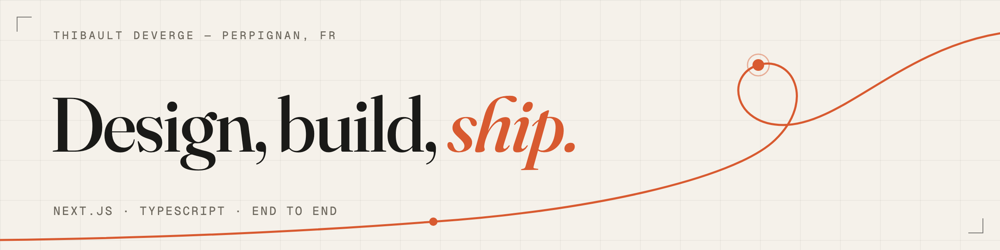

**Web developer at [elloha](https://www.elloha.com)** (SaaS for the tourism industry) **and freelance on production platforms.** I build complete applications with Next.js and TypeScript, from the interface to the database.

The road here was not a straight line: a law degree, two and a half years in Vietnam where I wrote my first lines of code, then [École 42](https://42.fr) for the fundamentals (C, Unix, algorithms, networking). I like knowing what happens under the framework.

### Proof over promises

- **[portfolio-2026](https://github.com/thibault-deverge/portfolio-2026)** · my portfolio as a product: an animation-first one-pager stitched together by a red thread drawn on scroll, plus an AI concierge (⌘K) built on Claude with streaming, tool use and Redis rate limiting. [See it live](https://thibault-deverge.vercel.app/en), and ask the palette anything about me.
- **NP-Evolution** · a skills-assessment platform designed, built and shipped solo for a real client: interactive PDF booklets, eIDAS level 1 signatures implemented from scratch, AI-assisted test interpretation. In production since August 2025, publicly recommended by the client. Private repo; [the full story is on the portfolio](https://thibault-deverge.vercel.app/en).
- **At elloha** · features shipped end to end on a back-office used daily by thousands of tourism professionals: complex React / Material UI screens, i18n in five languages, critical paths where a bug costs real money.

### From École 42, in C and beyond

[ft_transcendence](https://github.com/thibault-deverge/42-Cursus__Ft-Transcendence) · real-time multiplayer web app (final team project) &nbsp;—&nbsp; [minishell](https://github.com/thibault-deverge/42-Cursus__Minishell) · a Unix shell rebuilt in C &nbsp;—&nbsp; [cub3d](https://github.com/thibault-deverge/42-Cursus__Cub3d) · a raycasting engine à la Wolfenstein 3D

### How I work

The need first: question, reframe, sketch before writing code. Then small steps, constant feedback, and the discipline to finish. Law school gave me the rigor; 42 taught me how to learn; production keeps me honest.

### Contact

[Portfolio](https://thibault-deverge.vercel.app/en) · [LinkedIn](https://www.linkedin.com/in/thibault-deverge/) · [thibault.deverge@gmail.com](mailto:thibault.deverge@gmail.com)
