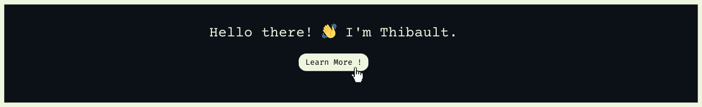

<h3 align="center">Aspiring Full-Stack Developer | Web Enthusiast | Student at School 42</h3>

<h2>👋 Hi there! I'm Thibault, a web developer with a unique journey from law to code.</h2>

👨 After earning my law degree, I took a bold step and spent 3 years living and traveling across Asia, which sparked my dream of becoming a <strong>digital nomad</strong>. That’s when I discovered my passion for technology and set my sights on a career in <strong>web development</strong>.

📠I returned to France to join <strong>School 42</strong>, where I learned the fundamentals of programming, including memory management and low-level features in <strong>C</strong>, following the best practices of computer science. This solid foundation led me to explore the world of <strong>web development</strong>, where I now specialize in <strong>React</strong> and <strong>Django</strong>.

🌠My goal? To merge my love for travel with my passion for coding—building cutting-edge web applications while working remotely from anywhere in the world.

<h3 align="left">Connect with me:</h3>

    <a href="mailto:thibault.deverge@gmail.com" target="blank">thibault.deverge@gmail.com</a>

<h3 align="left">Social Media:</h3>

    

<h3 align="left">Languages and Tools:</h3>

 
     
     
     
     
     

     
     
     
     
     
     
     

  

